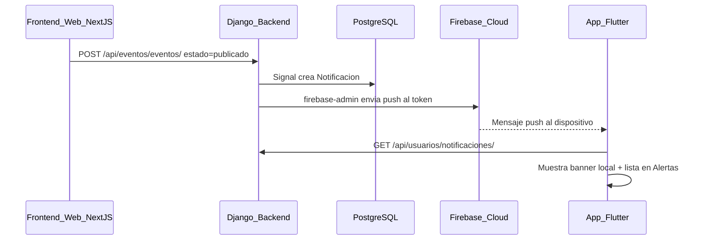

# Sistema de Notificaciones Push con Firebase — Documentación Académica

**Proyecto:** MisterTicket (capa móvil Flutter + backend Django)  
**Propósito:** Explicar herramientas, ubicación del código, flujo de rutas en la app y comunicación con el backend para que las notificaciones push (externas) y el buzón interno funcionen correctamente.

---

## 1. Visión general

El sistema de notificaciones combina **dos canales complementarios**:

| Canal | Tecnología | Qué hace |
|-------|------------|----------|
| **Externo (push)** | Firebase Cloud Messaging (FCM) | Muestra banner/sonido en el dispositivo aunque el usuario no esté en la pantalla de Alertas |
| **Interno (buzón)** | REST API Django + PostgreSQL | Guarda el historial de alertas que se lista en la pestaña **Alertas** de la app |

No se usa WebSocket. La actualización del buzón se logra con:

1. Recepción de un mensaje FCM (`onMessage` / `onBackgroundMessage`)
2. Polling cada 15 segundos mientras la app está activa (respaldo académico)
3. Pull-to-refresh o al entrar a la pestaña Alertas



---

## 2. Herramientas y librerías

### 2.1 App móvil (Flutter)

Definidas en [`pubspec.yaml`](../pubspec.yaml):

| Paquete | Versión | Rol académico |
|---------|---------|---------------|
| `firebase_core` | ^2.27.0 | Inicializa el SDK de Firebase en la app |
| `firebase_messaging` | ^14.7.19 | Obtiene token FCM y escucha mensajes push |
| `flutter_local_notifications` | ^17.0.0 | Muestra banner con sonido cuando la app está en primer plano |
| `provider` | ^6.1.5 | Estado global (`NotificacionProvider`, `AuthProvider`) |
| `shared_preferences` | ^2.5.5 | Persiste tokens JWT para sesión |
| `http` | ^1.6.0 | Cliente HTTP hacia Django |

### 2.2 Backend (Django)

Definidas en [`MisterTicket/backend/requirements.txt`](../../MisterTicket/backend/requirements.txt):

| Paquete | Rol |
|---------|-----|
| `firebase-admin` | SDK servidor para enviar push desde Django a FCM |
| `djangorestframework` + `simplejwt` | API REST y autenticación Bearer |
| `django` signals (`post_save`) | Dispara notificaciones al publicar un evento |

### 2.3 Infraestructura externa

| Servicio | Uso |
|----------|-----|
| **Firebase Console** | Proyecto `misterticket-alertas-sw1`, app Android registrada |
| **google-services.json** | Configuración del cliente Android en Firebase |
| **firebase-credentials.json** | Cuenta de servicio del backend (raíz de `MisterTicket/backend/`) |

---

## 3. Mapa de archivos — ¿Dónde está cada cosa?

### 3.1 App móvil (`mister_ticket_movil/`)

```
lib/
├── main.dart                          # Inicializa Firebase + handler background FCM
├── config/
│   └── routes.dart                    # Rutas nombradas de la app
├── core/
│   ├── constants/api_constants.dart   # URL base del backend y endpoints
│   ├── bootstrap/app_bootstrap.dart   # Inicialización post-login (FCM, perfil, alertas)
│   ├── notifications/
│   │   ├── fcm_config.dart            # Canal Android, permisos, helper de banner local
│   │   └── fcm_background_handler.dart # Handler FCM con app en background
│   ├── api/notificacion_api.dart      # Endpoints HTTP de notificaciones
│   └── network/api_client.dart        # Cliente HTTP con JWT en headers
├── data/
│   ├── models/notificacion.dart       # Modelo JSON de una alerta
│   ├── services/notificacion_service.dart
│   └── repositories/notificacion_repository.dart
└── presentation/
    ├── state/
    │   ├── auth_provider.dart         # Sesión persistente
    │   └── notificacion_provider.dart # FCM, polling, buzón de alertas
    └── pages/
        ├── splash_page.dart           # Restaura sesión al abrir la app
        ├── login_page.dart
        ├── dashboard_page.dart        # Tabs + lifecycle (refresco al volver)
        └── notificaciones/
            ├── notificaciones_page.dart       # Lista del buzón interno
            ├── widgets/notificacion_list_item.dart
            └── pages/detalle_evento_notificacion_page.dart

android/app/
├── google-services.json               # Config Firebase del proyecto Android
└── src/main/AndroidManifest.xml       # Permisos POST_NOTIFICATIONS, canal FCM
```

### 3.2 Backend Django (`MisterTicket/backend/`)

```
apps/
├── eventos/
│   ├── signals.py                     # Dispara notificaciones al publicar evento
│   └── apps.py                        # Registra signals en ready()
└── usuarios/
    ├── models/
    │   ├── notificacion.py            # Historial interno de alertas
    │   ├── dispositivo.py             # Tokens FCM por usuario
    │   └── seguidor.py                # Fans que siguen a un promotor
    ├── utils/firebase_helper.py       # enviar_push_fcm() con firebase-admin
    └── views/notificacion.py          # API REST de notificaciones y dispositivos

firebase-credentials.json              # Credenciales de cuenta de servicio (NO subir a git público)
```

### 3.3 Frontend web (disparador indirecto)

```
MisterTicket/frontend/src/app/eventos/components/EventoModal.js
```

El modal web **no llama a Firebase**. Solo hace `POST /api/eventos/eventos/`. El backend ejecuta la lógica de notificaciones de forma transparente.

---

## 4. Flujo de rutas en la app móvil

### 4.1 Rutas registradas

Archivo: [`lib/config/routes.dart`](../lib/config/routes.dart)

| Ruta | Pantalla | Cuándo se usa |
|------|----------|---------------|
| `/splash` | `SplashPage` | **Ruta inicial** al abrir la app |
| `/` | `LoginPage` | Si no hay sesión guardada |
| `/dashboard` | `DashboardPage` | Usuario autenticado (tabs principales) |
| `/perfil` | `PerfilPage` | Perfil del usuario |
| `/add-musica` | `AddMusicaPage` | Subir música (artistas) |

La ruta inicial se define en [`lib/main.dart`](../lib/main.dart):

```dart
initialRoute: AppRoutes.splash,
```

### 4.2 Flujo de arranque (sesión persistente)

```mermaid
flowchart TD
    A[App inicia en /splash] --> B{restoreSession}
    B -->|Token valido| C[bootstrapAuthenticatedApp]
    B -->|Sin token o invalido| D[/login]
    C --> E[inicializarFCM]
    C --> F[cargarNotificaciones]
    C --> G[loadProfile]
    C --> H[iniciarPolling 15s]
    E --> I[/dashboard]
    D --> J[Login exitoso]
    J --> C
```

**Archivos involucrados:**

- [`splash_page.dart`](../lib/presentation/pages/splash_page.dart) — valida sesión
- [`auth_service.dart`](../lib/data/services/auth_service.dart) — guarda/lee JWT en `SharedPreferences`
- [`app_bootstrap.dart`](../lib/core/bootstrap/app_bootstrap.dart) — centraliza inicialización post-login

### 4.3 Navegación dentro del Dashboard

Archivo: [`dashboard_page.dart`](../lib/presentation/pages/dashboard_page.dart)

Usa `IndexedStack` + `BottomNavigationBar`. Las pestañas dependen del rol:

**Fan:** Inicio | Alertas | Tickets | Mi Música | Yo  
**Artista:** Inicio | Alertas | Mi Música | Yo

La pestaña **Alertas** carga [`notificaciones_page.dart`](../lib/presentation/pages/notificaciones/notificaciones_page.dart), que consume `NotificacionProvider.notificaciones`.

---

## 5. Comunicación con el backend Django

### 5.1 Configuración de la URL del API

Archivo: [`lib/core/constants/api_constants.dart`](../lib/core/constants/api_constants.dart)

```dart
static const String baseUrl = String.fromEnvironment(
  'API_URL',
  defaultValue: 'http://192.168.1.100:8000/api',
);
```

**Dispositivo físico en la misma WiFi:**

```bash
flutter run --dart-define=API_URL=http://<IP_DE_TU_PC>:8000/api
```

El backend debe escuchar en todas las interfaces:

```bash
python manage.py runserver 0.0.0.0:8000
```

### 5.2 Autenticación (JWT)

Todas las peticiones de notificaciones requieren header:

```
Authorization: Bearer <access_token>
```

El token se guarda en login ([`auth_service.dart`](../lib/data/services/auth_service.dart)) y lo adjunta [`api_client.dart`](../lib/core/network/api_client.dart).

### 5.3 Endpoints REST utilizados por el móvil

| Método | Endpoint Django | Archivo Flutter | Propósito |
|--------|-----------------|-----------------|-----------|
| `POST` | `/api/usuarios/login/` | `auth_api.dart` | Obtener JWT |
| `GET` | `/api/usuarios/perfil/` | `auth_api.dart` | Validar sesión al restaurar |
| `POST` | `/api/usuarios/token/refresh/` | `auth_api.dart` | Renovar access token |
| `POST` | `/api/usuarios/dispositivos/registrar/` | `notificacion_api.dart` | **Registrar token FCM** |
| `GET` | `/api/usuarios/notificaciones/` | `notificacion_api.dart` | Listar buzón interno |
| `PATCH` | `/api/usuarios/notificaciones/{id}/leer/` | `notificacion_api.dart` | Marcar como leída |
| `POST` | `/api/usuarios/notificaciones/leer-todas/` | `notificacion_api.dart` | Marcar todas leídas |
| `DELETE` | `/api/usuarios/notificaciones/{id}/` | `notificacion_api.dart` | Eliminar alerta |
| `POST` | `/api/usuarios/promotores/{id}/seguir/` | `notificacion_api.dart` | Seguir/dejar de seguir promotor |
| `GET` | `/api/usuarios/promotores/siguiendo/` | `notificacion_api.dart` | IDs de promotores seguidos |

### 5.4 Capas de acceso a datos en Flutter

Patrón usado en todo el proyecto:

```
UI (notificaciones_page.dart)
    ↓ Provider
NotificacionProvider (notificacion_provider.dart)
    ↓ Repository
NotificacionRepository (notificacion_repository.dart)
    ↓ Service
NotificacionService (notificacion_service.dart)
    ↓ API
NotificacionApi (notificacion_api.dart)
    ↓ Cliente HTTP
ApiClient (api_client.dart)  →  Django REST API
```

---

## 6. Flujo completo: publicar evento → push en el móvil

### Paso 1 — Registro del dispositivo (requiere usuario autenticado)

Cuando el usuario entra al Dashboard (o restaura sesión en Splash):

1. `NotificacionProvider.inicializarFCM()` pide permisos Android 13+ (`POST_NOTIFICATIONS`)
2. `FirebaseMessaging.instance.getToken()` obtiene el token FCM del dispositivo
3. Se envía al backend:

```http
POST /api/usuarios/dispositivos/registrar/
Authorization: Bearer <jwt>
Content-Type: application/json

{ "fcm_token": "fFI-FSWvQ76gpQUKYhQl..." }
```

4. Django guarda en tabla `dispositivos_usuario` asociado al usuario logueado

**Código backend:** `DispositivoViewSet.registrar` en [`notificacion.py`](../../MisterTicket/backend/apps/usuarios/views/notificacion.py)

> **Importante:** Sin login no se registra token FCM. El endpoint exige `IsAuthenticated`.

### Paso 2 — Fan sigue al promotor (requisito de negocio)

El fan debe tocar el botón **Seguir** (estrella) en el feed:

- UI: [`evento_interacciones_bar.dart`](../lib/presentation/pages/home/widgets/evento_interacciones_bar.dart)
- API: `POST /api/usuarios/promotores/{id}/seguir/`
- BD: tabla `seguidores_promotores`

Sin este paso, **no se crea notificación** para ese fan.

### Paso 3 — Promotor publica evento desde la web

1. Web: `EventoModal.js` → `POST /api/eventos/eventos/` con `estado: "publicado"`
2. Django guarda el `Evento`
3. Signal `notificar_publicacion_evento` en [`signals.py`](../../MisterTicket/backend/apps/eventos/signals.py):
   - Busca seguidores del promotor
   - Crea registros en `notificaciones`
   - Llama `enviar_push_fcm()` por cada usuario elegible

### Paso 4 — Backend envía push vía Firebase Admin

Archivo: [`firebase_helper.py`](../../MisterTicket/backend/apps/usuarios/utils/firebase_helper.py)

```python
message = messaging.Message(
    notification=messaging.Notification(title=titulo, body=cuerpo),
    data={...},  # incluye evento_id, title, body
    token=token_del_dispositivo,
    android=messaging.AndroidConfig(
        priority='high',
        notification=messaging.AndroidNotification(
            channel_id='mister_ticket_push_channel',
            sound='default',
        ),
    ),
)
messaging.send(message)
```

**Requisitos del backend:**

- `pip install firebase-admin` (incluido en `requirements.txt`)
- Archivo `firebase-credentials.json` en la raíz del backend
- Reiniciar `runserver` después de instalar dependencias

### Paso 5 — App móvil recibe y muestra

| Estado de la app | Comportamiento |
|------------------|----------------|
| **Primer plano** | `FirebaseMessaging.onMessage` → banner local con sonido → `cargarNotificaciones()` |
| **Background** | `firebaseMessagingBackgroundHandler` → banner del sistema |
| **Cerrada** | FCM muestra notificación del sistema; al abrir, `getInitialMessage()` redirige al evento |
| **Polling activo** | Cada 15 s consulta API; si hay alerta nueva, muestra banner de respaldo |

**Archivos clave:**

- [`main.dart`](../lib/main.dart) — registra `onBackgroundMessage`
- [`notificacion_provider.dart`](../lib/presentation/state/notificacion_provider.dart) — listeners FCM + polling
- [`fcm_config.dart`](../lib/core/notifications/fcm_config.dart) — canal `mister_ticket_push_channel`
- [`AndroidManifest.xml`](../android/app/src/main/AndroidManifest.xml) — permisos y meta-data FCM

---

## 7. Push, autenticación y logout

El push **no comprueba si la app muestra Login o Dashboard en ese instante**. Firebase entrega al **token físico del dispositivo** que quedó registrado en la base de datos.

| Situación | ¿Llega push externo? | ¿Se ve buzón en Alertas? |
|-----------|----------------------|---------------------------|
| Nunca inició sesión | No (sin token en backend) | No |
| Sesión activa o restaurada (Splash) | Sí, si cumple condiciones | Sí |
| Hizo logout | **Sí puede llegar** (token sigue en BD) | No (sin JWT) |
| App cerrada con sesión guardada | Sí | Sí al reabrir |

**Limitación actual:** al cerrar sesión solo se borra el JWT local. El token FCM **no se elimina** del servidor, por lo que el push puede seguir llegando al teléfono aunque veas la pantalla de Login.

**Mejora pendiente (opcional):** endpoint `POST /api/usuarios/dispositivos/desregistrar/` llamado en `logout()`.

---

## 8. Configuración Firebase (checklist académico)

### 8.1 Firebase Console

1. Crear proyecto: `misterticket-alertas-sw1`
2. Registrar app Android con package: `com.example.mister_ticket_movil`
3. Descargar `google-services.json` → colocar en `android/app/`
4. Generar clave de cuenta de servicio → guardar como `MisterTicket/backend/firebase-credentials.json`

### 8.2 Android (`android/app/build.gradle.kts`)

```kotlin
id("com.google.gms.google-services")
applicationId = "com.example.mister_ticket_movil"
```

### 8.3 AndroidManifest.xml

```xml
<uses-permission android:name="android.permission.POST_NOTIFICATIONS"/>

<meta-data
    android:name="com.google.firebase.messaging.default_notification_channel_id"
    android:value="mister_ticket_push_channel" />

<meta-data
    android:name="com.google.firebase.messaging.default_notification_icon"
    android:resource="@mipmap/ic_launcher" />
```

### 8.4 Backend

```bash
cd MisterTicket/backend
../venv/Scripts/activate        # Windows
pip install -r requirements.txt
python manage.py runserver 0.0.0.0:8000
```

Verificar en consola al publicar evento:

```
Notificación PUSH enviada exitosamente al usuario fan1 al token fFI-FSWv...
```

Si aparece `firebase-admin no está instalado`, el push **no saldrá** (solo se guarda en BD).

---

## 9. Condiciones para que un fan reciba la notificación

| # | Requisito | Dónde verificar |
|---|-----------|-----------------|
| 1 | Fan **sigue** al promotor del evento | Estrella en feed móvil |
| 2 | Evento creado con estado **`publicado`** | Selector en EventoModal web |
| 3 | Usuario móvil ≠ promotor que crea el evento | No auto-notificación |
| 4 | `recibir_notificaciones = true` en perfil | Switch en Perfil móvil |
| 5 | Token FCM registrado en backend (requiere login) | Log: `[FCM] Token registrado correctamente` |
| 6 | `firebase-admin` instalado en backend | Log sin error de librería |
| 7 | Permisos de notificación aceptados en el teléfono | Ajustes → Apps → MisterTicket |
| 8 | App y PC en la **misma red WiFi** (dispositivo físico) | `API_URL` con IP local correcta |

---

## 10. Prueba académica paso a paso

1. **Backend:** `python manage.py runserver 0.0.0.0:8000`
2. **Móvil:** `flutter run --dart-define=API_URL=http://<IP_PC>:8000/api`
3. Login como `fan1` → aceptar permisos de notificación
4. En el feed, **seguir** al promotor del evento (estrella)
5. Web: login como promotor → crear evento **Publicado**
6. **Verificar backend:** log `Notificación PUSH enviada exitosamente...`
7. **Verificar móvil:**
   - Log `[FCM] Mensaje recibido en Foreground: ...` (app abierta)
   - Banner del sistema (app en background)
   - Registro en pestaña **Alertas** (máx. 15 s por polling)
8. Cerrar app completamente → reabrir → debe entrar directo al Dashboard (sesión persistente)

---

## 11. Diagnóstico de problemas frecuentes

| Síntoma | Causa probable | Solución |
|---------|----------------|----------|
| Aparece en Alertas pero **sin popup** | `firebase-admin` no instalado en backend | `pip install firebase-admin` y reiniciar Django |
| No aparece ni en Alertas | Fan no sigue al promotor | Usar botón Seguir en el feed |
| Token registrado pero sin push | Backend sin credenciales Firebase | Verificar `firebase-credentials.json` |
| Solo polling actualiza (~15 s) | FCM no llega al dispositivo | Revisar permisos, Google Play Services, logs FCM |
| Vuelve a pedir login al abrir app | Token expirado o borrado | Re-login; verificar `SharedPreferences` |
| API no responde en físico | IP incorrecta | `ipconfig` + `--dart-define=API_URL=...` |
| Push llega tras logout | Token FCM no se desregistra al cerrar sesión | Mejora pendiente: endpoint desregistrar en logout |

---

## 12. Referencias cruzadas

- Documentación general del sistema (3 capas): [`MisterTicket/implementacion_notificaciones.md`](../../MisterTicket/implementacion_notificaciones.md)
- Signal de publicación: [`MisterTicket/backend/apps/eventos/signals.py`](../../MisterTicket/backend/apps/eventos/signals.py)
- Helper FCM servidor: [`MisterTicket/backend/apps/usuarios/utils/firebase_helper.py`](../../MisterTicket/backend/apps/usuarios/utils/firebase_helper.py)

---

*Documento elaborado con fines académicos — Proyecto Final SW1, MisterTicket.*
